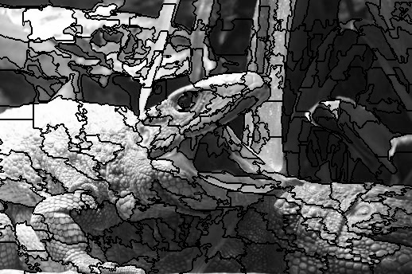
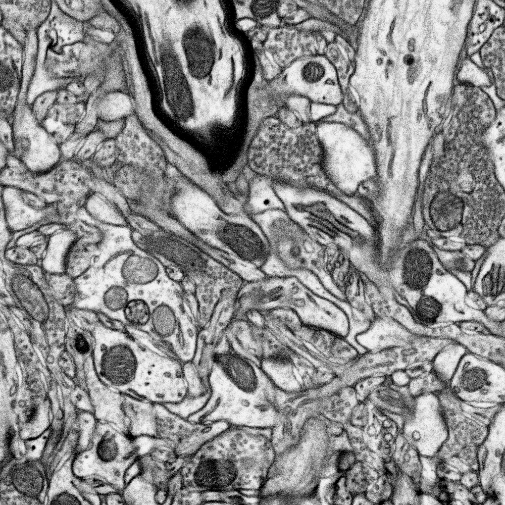
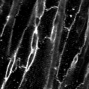
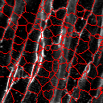
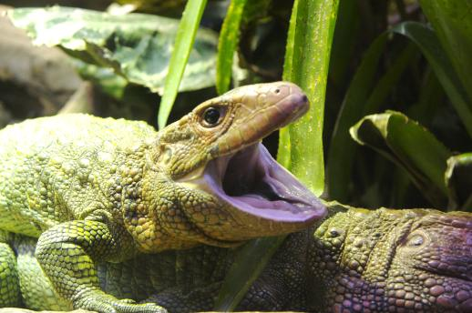
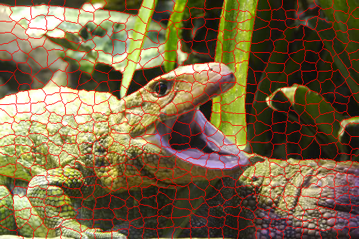

  # Turbo Voxels
  ITK implementation of turbovoxel segmentation and other useful segmentation/smoothing tools.
## Compiling
Compilation of this project is handled using `cmake`. To build first create a directory to build the project.
```bash
$ mkdir cmake-build
$ cd cmake-build
```
Generate the required makefiles using cmake. Before you run cmake make sure that you have ITK installed and ITK_DIR is set to appropriate path in the `CMakeLists.txt`
```bash
$ cmake ..
```
Finally, to compile simply run the `make` utility. 
```bash
$ make -j
```
If successful, the build process should generate an executable called `turbo` which when run with different options can be
used for various tasks explained in the usage section below.

## Related Papers
If you use the codes in this repository please consider citing the following associated paper.

_Syed, T. A., Wang, Y., Dileep, D., Sirajuddin, M., & Siddiqi, K._ (2023, June).
**Ultrastructure Analysis of Cardiomyocytes and Their Nuclei.**
_In International Conference on Functional Imaging and Modeling of the Heart (pp. 14-24). Cham: Springer Nature Switzerland._


## Usage
```bash
turbo -module -input <input_file_path> -output <output_file_name>
```

Options
===========================================
	 -input
		 path to input file
	 -output
		 path to output file (default <inputFileName>_smooth.ext)
	 -h, --help
		 display this help
	 -mcs         ::(mean Curvature Smoothing)
	 -mmcs        ::(min-max Curvature Smoothing)
	 -bmmcs       ::(binary min-max Curvature Smoothing)
	 -slic        ::(SLIC superpixels)
	 -otsu        ::(Otsu Thresholding)
	 -bradley     ::(Bradley Adaptive Thresholding)
	 -regionprops ::(Region props of objects in image)
	 -chanvese    ::(chan-Vese segmentation)
Mean/min-max Curvature Smoothing:
--------------------------------
		 -iterations N : (default = 1) number of iterations to run
		 -dt t         : (default = 0.125) time step for smoothing
		 -rescale      : (optional,false) weather to rescale output to [0,1]
		                 rescale changes extension of output to tif
		                 if float is not supported by output file
		 -radius R     : (unsigned) stencil radius for min-max flow (~noise size)
		 -thresh th    : (double) threshold value of binary image
                 -clamp        : clamp output value to range of input(default) or values supplied via -lthresh/-uthresh.

Chan-Vese Segmentation:
----------------------
		 -iterations N : (default = 1) number of iterations to run
		 -smooth N     : (default off) smooth input using min-max
		                 curvature smoothing, default N = 10
		 -dt t         : (default = 0.125) time step for smoothing
		 -radius R     : (default = 2) stencil radius for min-max flow choose proportional to noise size
		 -lthresh lt   : (default = non +ve min) lower thresh for init mask
		 -uthresh ut   : (default = max) upper thresh for init mask
		 -background   : flip initial mask
		 -lambda l     : (default = 0.5) weight of internal term.
		                  Weight of external term is fixed at 1
		 -debug        : saves initial mask and final levelset image


Slic SuperPixel:
----------------------
		 -iterations N : (default = 10) number of iterations to run
		 -weight w     : (default = 1) Proximity weight for superpixels
		 -writelabels N: (optional, 0)Write output image labelled by superpixel id
		                  0(off), 1(labelId), 2(Hot), 3(Cool), 4(Autumn), (>5)Jet
		 -seedcount N  : (optional, 100) approx. number of superpixels


Otsu Thresholding:
----------------------
		 -iterations N : (optional, 0) number of iterations of pre-process smoothing
		 -radius w     : (optional, 2) stencil radius for smoothing
		 -dt t         : (optional, 0.125) time step for pre-smoothing
		 -dark         : (optional,false) flip polarity of output


Bradley Adaptive Thresholding:
----------------------
		 -sensitivity s : (optional, 0.5) foreground sensitivity
		 -window w      : (optional, max_image_dim/8) size of window for estimating local threshold
		 -dark         : (optional,false) flip polarity of output
		 -writeThreshold: (optional, false) write the threshold image used for thresholding


Region props:
----------------------
		 -size s : (optional, 100) size(pixels) of smallest object to consider
		 -dark   : (optional, false) flip image intensity

Turbo Voxels:
----------------------
		 -seedcount      : (optional, 150) Number of turbovoxels to seed.Can be overriden if -size is specified
		 -smoothing      : (optional, 10) smoothing iteration for speed computation
		 -propagation    : (optional, 1) weight of the constant prop. term in level set evoluiton
		 -curvature      : (optional, 0.3) weight of the curvature term in level set evoluiton
		 -advection      : (optional, 5) weight of the doublet (advection) term in level set evoluiton
		 -iterations    : (optional, 1000) Maximum number of iteration to run for. Will stop early if rms difference between updates is below -rmsthreshold
		 -rmsthreshold  : (optional, 1) Stopping threshold for RMS difference between updates. 
		 -dt             : (optional, _) Value of timestep for evolution. Should not be set manually unless you know what you are doing
		 -observe        : (optional[debug], false) Runs debug Evolution observer writing intermediate images and log
		 -rgb            : (optional[debug], false) Saves pseudo-color rgb images inside evolution observer 


Examples:
=========
#### SLIC superpixel example:
```bash
$./turbo -slic -input lizard.jpg -writelabels 5 -seedcount 250
```

#### Chan-Vese segmentation example:
```bash
$ ./turbo -chanvese -lthresh 1 -uthresh 1000 -smooth -input dapi3d.tif
```
#### Perform mean curvature smoothing:
```bash
$./turbo -mcs -dt 0.05 -iterations 200 -input EM2D.tif 
```
 

#### Turbovoxel example:
```bash
$./turbo -turbovoxels -input wga3d.tif -seedcount 500 -iterations 500 -rmsthreshold 0.1 -edgescale 25 -curvature 0.3 -advection 0.2
```


```bash
$./turbo -turbovoxels -input lizard.jpg -seedcount 500 -gradientseeding -iterations 500 -edgescale 12.5 -curvature 0.3 -advection 0.2
```



------------------------------------------

